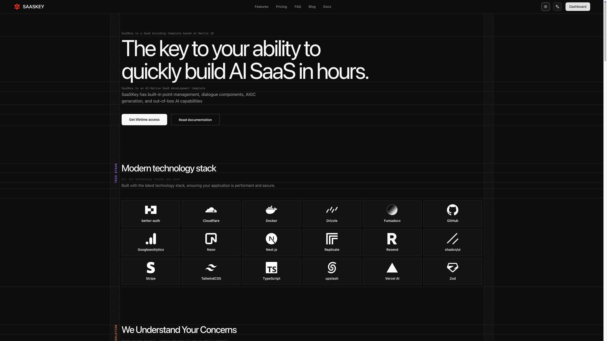
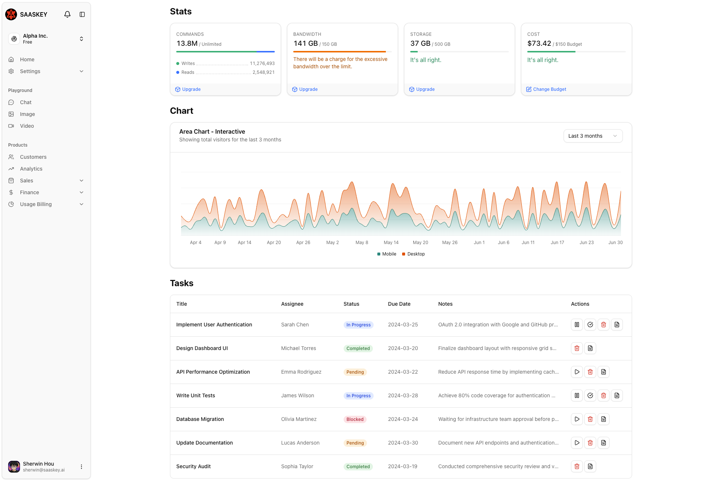

# Saaskey.ai - The key to building your AI SaaS in hours.

<div align="center">
  <a href="https://saaskey.ai">
    
  </a>
  <br />
  <br />
  <p align="center">
    <strong>🇺🇸 English</strong> | <a href="./README_zh.md">🇨🇳 中文</a>
  </p>

  <h3 align="center">Ship your AI SaaS in days, not months.</h3>

  <p align="center">
    A simplified, high-performance Next.js 16 Boilerplate.
    Built by an Indie Hacker, for Indie Hackers.
    <br />
    <br />
    <a href="https://github.com/xijaja/saaskey/issues">Report Bug</a>
    ·
    <a href="https://github.com/xijaja/saaskey/issues">Request Feature</a>
    ·
    <a href="https://saaskey.ai" rel="noopener" target="_blank">Explore the Website</a>
  </p>

  <p align="center">
    
    
    
    
  </p>
</div>

---





## 👨‍💻 The Story Behind Saaskey

Hi, I'm **[@xijaja](https://x.com/xijaja)**.

I am not a Computer Science major. **I am a Product Manager with 8 years of experience.** In May of this year, I left my job to teach myself coding and become a full-time Indie Hacker.

**My Journey:**
At first, I fell in love with **SvelteKit** for its simplicity. But as I tried to build complex SaaS apps, I hit a wall: the ecosystem just wasn't big enough yet. So, I bit the bullet and moved to **Next.js**.

**Why Open Source?**
Originally, I planned to sell this as a paid boilerplate. But I realized two things:
1.  I don't want to spend my days doing customer support. I want to build products.
2.  I believe the best way to learn is to share. I learned the hard way so you don't have to.

I've stripped away the overly complex logic and kept the core: **A beautiful UI, rock-solid Authentication, and a modern Database setup.** It is a clean canvas. You can focus on your unique value proposition without wrestling with configuration.

---

## ✨ Features

* **Framework:** [Next.js 16](https://nextjs.org/) (App Router) & [React 19](https://react.dev/).
* **Styling:** [Tailwind CSS v4](https://tailwindcss.com/) - The latest engine.
* **Authentication:** [Better Auth](https://www.better-auth.com/) - Secure, type-safe, and modern.
* **Database:** [Drizzle ORM](https://orm.drizzle.team/) & [Postgres](https://neon.tech/) (Neon ready).
* **AI Integration:** Pre-configured [Vercel AI SDK](https://sdk.vercel.ai/docs) & [Replicate](https://replicate.com/).
* **AI UI Components:** **Ready-to-use interfaces** for Chat, Image Generation, and Video Generation.
* **Multi-Tenancy:** Built-in dashboard with **Organization/Team switching** support.
* **Internationalization:** Complete **i18n** support and **SEO** optimization out of the box.
* **Developer Experience:** **Bilingual code comments (English & Chinese)** to help you understand the logic.
* **Deployment:** **Dockerfile** included for easy containerized hosting.
* **Payments:** [Stripe](https://stripe.com/) subscription ready.
* **Emails:** [Resend](https://resend.com/) & [React Email](https://react.email/).
* **Content:** MDX via [Content Collections](https://www.content-collections.dev/).

## 🛠️ Tech Stack

| Category       | Technology                           |
| :------------- | :----------------------------------- |
| **Core**       | Next.js 16, React 19, TypeScript     |
| **Database**   | PostgreSQL, Drizzle ORM              |
| **Auth**       | Better Auth                          |
| **Payments**   | Stripe                               |
| **UI/Styling** | Tailwind v4, Radix UI, Framer Motion |
| **AI**         | Vercel AI SDK, Replicate             |
| **Email**      | Resend, React Email                  |
| **Forms**      | React Hook Form, Zod                 |

## ⚡ Getting Started

### Prerequisites

- Node.js 20+ or [Bun](https://bun.sh/) (Recommended)
- A PostgreSQL database (e.g., local or Neon)
- Stripe, Resend, and Better Auth API keys

### Installation

1.  **Clone the repository:**
    ```bash
    git clone [https://github.com/xijaja/saaskey.git](https://github.com/xijaja/saaskey.git)
    cd saaskey
    ```

2.  **Install dependencies:**
    ```bash
    npm install
    # or
    bun install
    ```

3.  **Set up environment variables:**
    Rename `.env.example` to `.env.local` and fill in your secrets.
    ```bash
    cp .env.example .env.local
    ```

4.  **Database Setup:**
    Push the schema to your database.
    ```bash
    npm run db:push
    ```

5.  **Run the development server:**
    ```bash
    npm run dev
    ```
    Open [http://localhost:3000](http://localhost:3000) with your browser to see the result.

## 🌟 Support

"If SaaSKey has saved you time or helped you in any way, please give it a **Star** 🌟. 
Your support keeps me motivated!

You can also support the project by sharing it on social media or showcasing the products you've built with it. Additionally, reporting issues or sharing ideas from your real-world experience will help make this project even better."

## 🗺️ Roadmap

I am actively building this. Here is my current plan:

- [x] **Authentication:** Complete Better Auth integration (Email/Pass + Social)
- [x] **Database:** Drizzle ORM + Postgres setup with Schema
- [x] **Payments:** Stripe Subscription (Checkout, Webhooks & Customer Portal)
- [x] **AI UI:** Ready-to-use UI for Streaming Chat, Image Generation, and Video Generation
- [x] **Dashboard:** Multi-organization/Team switching support
- [x] **Internationalization:** Full i18n & SEO support
- [x] **Deployment:** Dockerfile included for containerized hosting
- [x] **Content:** MDX Blog system via Content Collections
- [x] **Emails:** Transactional emails with Resend & React Email
- [ ] **Workflow:** Integration with [Inngest](https://www.inngest.com/).
- [ ] **Payments:** Support for [Creem](https://creem.io/).
- [ ] **Payments:** Support for [Polar.sh](https://polar.sh/).
- [ ] **Affiliate:** Integration with [Affonso.io](https://affonso.io/).
- [ ] **Affiliate:** Integration with [Promotekit.com](https://promotekit.com/).
- [ ] **Email Marketing:** Integration with [Useplunk.com](https://www.useplunk.com/).
- [ ] **Email Marketing:** Integration with [Loops.so](https://loops.so/).
- [ ] **Analytics:** Privacy-friendly analytics with [Rybbit.com](https://rybbit.com/).
- [ ] **Legal:** GDPR Cookie Consent Popup.
- [ ] **Templates:** User Agreement & Cookie Policy templates.
- [ ] **Documentation:** Add [Fumadocs](https://fumadocs.vercel.app/).
- [ ] **CMS:** Add Stash integration.
- [ ] **Deployment:** Cloudflare Workers support.
- [ ] **Themes:** 2nd Landing Page Theme.

## 🤝 Connect

I share my journey of building SaaS products and learning to code on X (Twitter).

If you have any questions or just want to say hi, feel free to DM me!

<a href="https://x.com/xijaja">
  
</a>

## 📄 License

Distributed under the MIT License. See `LICENSE` for more information.

---

<div align="center">
  Built with ❤️ by <a href="https://x.com/xijaja">xijaja</a>
</div>